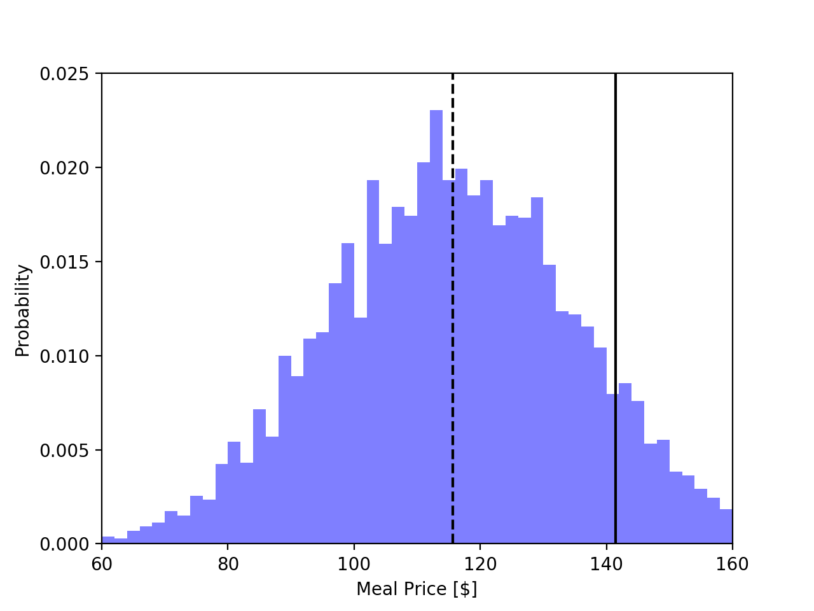

# Restaurant Pricing

So you're going to [Edibles](http://ediblesrochester.com) on University Avenue in the Neighborhood of the Arts. It's a casual dining spot with eclectic eats and a location with a history. The restaurant features tall tin ceilings, original hardwoods, and a unique location in the Flatiron building. The food pulls in influences from Eastern Europe, but blends it with typical New American fare. Complemented by delicious cocktails and a spread of appetizers, you're sure to have a great time!


## Code Description
This script is a Monte-Carlo simulation to determine the probability distribution function for the price of a meal at Edibles, but tailored to your specific preferences and to Edibles selection of menu items. I've used this code to set the gift amount. The gift card amount is set based on the 50% confidence interval and the additional cash is set based on the 90% confidence interval. Meaning, if you go out to eat at Edibles every day of the year for the next 273 years (100,000 times), this gift card and cash would cover the whole meal, tip, and tax 90% of the time.

The script pulls in menu pricing information and will stochastically and iteratively formulate a meal. For example, one meal may have two appetizers and the most expensive dessert whereas the next may only have one appetizer and no dessert. All of these decisions are dictated by independent event probability distribution functions. These are all then aggregated into an overall meal price probability distribution function, from which the final gift price is set.

## Results
I know, this is terrible practice. But for the purposes of this gift, I'm going to assume the results are static and summarize in the markdown file. Let's get started.

The meal price probability distribution function for (my interpretation of) your preferences is shown below. The price specified by the 50th percentile is given in the form of a gift card. To ensure you don't get stuck with unused gift card monies, the remaining balance to get you up to the 90th percentile will be given in the form of cash.



To summarize, here is the total value of the gift.

```
Total Value: $141.44
  Gift Card: $115.62
  Cash Value: $25.82
```
